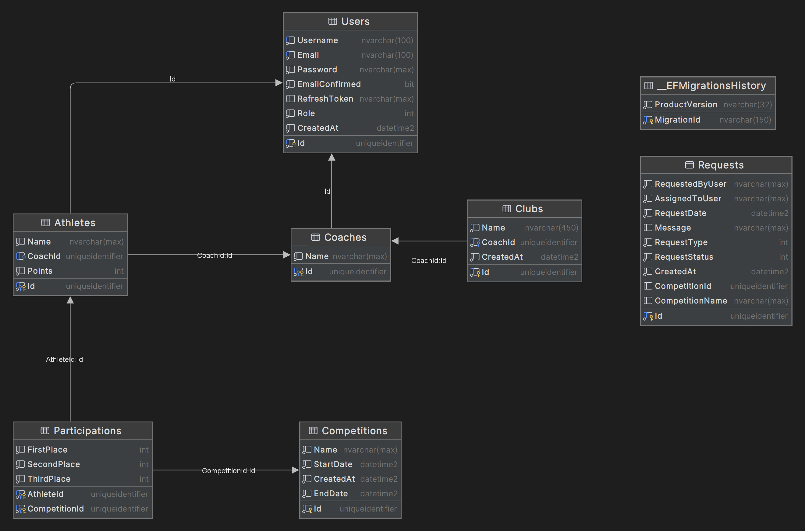

# Karate Club Management System

This project aims to create a comprehensive Karate Club Management System using the .NET API for the back end and Next.js for the front end. The system focuses on efficiently managing karate clubs, their coaches, and athletes participating in competitions. The features include athlete achievements, competition results, and an overall ranking system.

## User Stories

1. As a new user, I want to be able to sign up for an account, so that I can access the platform.
    Acceptance Criteria:
   - Signup form available with fields for email and password.
   - Confirmation email sent after successful signup.
   - User redirected to login page after confirming email.
2. As an existing user, I want to log in to my account, so that I can access my dashboard.
    Acceptance Criteria:
    - Login form available with fields for email and password.
    - Successful login redirects to the dashboard.
3. As an athlete, I want to request to join a competition, so that I can participate in upcoming events.
    Acceptance Criteria:
    - Option to request competition participation available on the profile page.
    - Notification sent to the coach after request submission.
4. As a coach, I want to register a club, so that I can manage my athletes and their competition participation.
    Acceptance Criteria:
    - Form available for club registration with required fields.
    - Confirmation notification sent upon successful club registration.
5. As a coach, I want to accept an athlete's request to join a competition, so that they can participate in the event.
    Acceptance Criteria:
    - List of requests to join competitions visible in club management.
    - Option to accept or reject requests.
    - Athlete receives a notification regarding the acceptance or rejection.
6. As an athlete, I want to view my awards and rankings after a competition, so that I can track my progress.
    Acceptance Criteria:
    - Awards and ranking details updated after the competition ends.
    - Information visible in the profile section.
7. As an athlete, I want to view a list of upcoming competitions, so that I can plan and prepare for participation.
    Acceptance Criteria:
    - List of upcoming competitions available on the dashboard.
    - Details such as date, and deadline are provided.
8. As an athlete, I want to receive a confirmation notification when my request to join a competition is accepted, so that I know I am officially participating.
    Acceptance Criteria:
    - Notification sent to the athlete confirming their participation.
    - Details of the competition are included in the notification.
9. As a coach, I want to receive notifications when an athlete updates their profile or requests to join a competition, so that I can stay informed about my athletes' activities.
    Acceptance Criteria:
    - Notifications sent to the coach when an athlete updates their profile.
    - Notifications sent to the coach when an athlete requests to join a competition.
10. As an athlete, I want to see my performance after a match by seeing the moves I made.
    Acceptance Criteria:
    - Saving of moves after every match
    - Possibility to view for a match the moves a player has made

## Backlog

- API Hosting - Digital Ocean
- Backend possibilities for a live fight features
- Live fights mockup
- Investigate and document rules for a live fighting

## Workflow Chart


## Backend (.NET API)

### Setup
1. Clone the repository: `git clone https://github.com/victorstefan28/net-project`
2. Navigate to the backend folder: `cd dotNet-backend/dotNet-backend`
3. Restore dependencies: `dotnet restore`
4. Update database: `dotnet ef database update`
5. Run the API: `dotnet run`

## Frontend (Next.js)

### Prerequisites
- [Node.js](https://nodejs.org/)
- [npm](https://www.npmjs.com/)

### Setup
1. Navigate to the frontend folder: `cd next-frontend`
2. Install dependencies: `npm install`
3. Run the application: `npm run dev`

### Features
- View club details, coach information, and athlete profiles.
- Manage competitions and view medal achievements.
- Display rankings based on points earned by athletes.

## Database diagram


## How to create Database in SQL Server

- start Docker Desktop
- open Terminal

#### Pull image from Docker Hub and run container
```bash
docker pull mcr.microsoft.com/mssql/server:2022-latest

docker run -e "ACCEPT_EULA=Y" -e "MSSQL_SA_PASSWORD=Database.net.2023" -p 1433:1433 --name sqlserver-db-dotnet --hostname dotnet -d  mcr.microsoft.com/mssql/server:2022-latest

docker exec -it sqlserver-db-dotnet "bash"

/opt/mssql-tools/bin/sqlcmd -S localhost -U SA -P Database.net.2023
```
#### Create Database and User
```sql
CREATE DATABASE Database_Karate;
GO
USE Database_Karate;
GO
CREATE LOGIN db_user WITH PASSWORD = "Database.net.user.2023";
GO
CREATE USER db_user FOR LOGIN db_user
GO
EXEC sp_addrolemember 'db_owner', 'db_user';
GO
QUIT
```
#### Connect to Database in Visual Studio
```
In Visual Studio IDE
Click View 
=> Server Explorer 
=> Add Connection 

Data source:    Microsoft SQL Server 
Server Name:    localhost
Authentication: SQL Server Authentication
User Name:      db_user
Password:       Database.net.user.2023
Encrypt:        False
Database Name:  Database_Karate

Click Test Connection
Click OK
```


### Connection String
```
Data Source=localhost;Initial Catalog=Database_Karate;User ID=db_user;Password=Database.net.user.2023;Encrypt=False;MultipleActiveResultSets=True;TrustServerCertificate=True"
```
